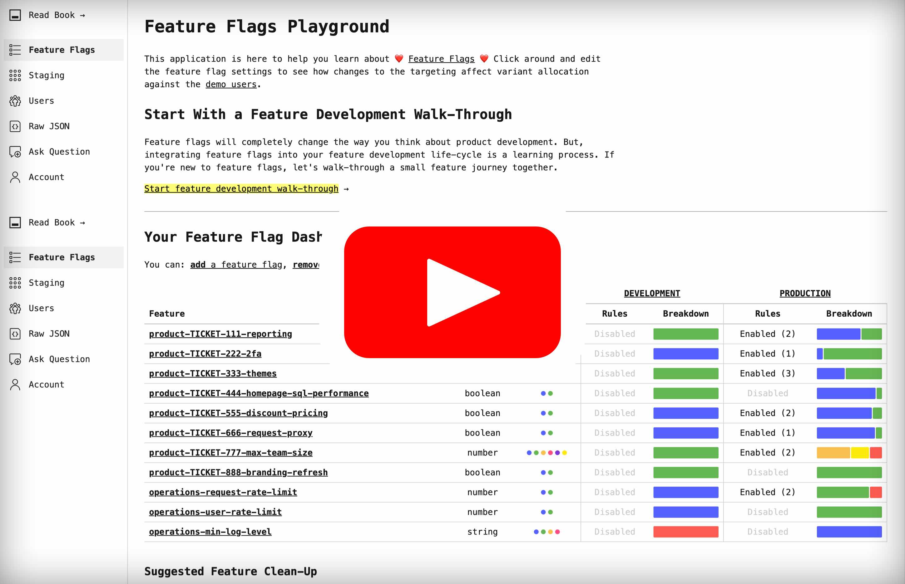

# Feature Flags Book Playground

by [Ben Nadel][ben-nadel]

As a fun experiment, I wanted to build a small playground companion to my [Feature Flags Book][book]. This is a place where readers can log into a system and try creating feature flags and updating targeting rules to get a sense of how a feature flags / feature toggles system can be used.

[Log into the playground][app] &rarr;

[](https://www.youtube.com/watch?v=rXN3mqm2l7A&list=PLMptQ3mXeP80TBnkvnuyX7XHId4Q0rFBf)

## Feature Flags Data Structure

A feature flags system is really just a rules engine that takes application-provided inputs (such as `userID` or `userEmail`), funnels them through a set of rules, and then returns a predictable and repeatable result. Meaning, the same inputs will always yield the same result as long as the configured rules have not changed.

### Resolution Type

The majority of feature flags that I use are Boolean types that conditionally enable new feature experiments and performance improvements. For these types of flags, a finite set of variants along with a percent-based distribution makes a lot of sense &mdash; it allows you to incrementally roll-out a new feature; and, to react quickly to any early signs of a problem.

For some types of _operational_ feature flags, however, dealing with a finite set of variants and a percent-based allocation feels unnatural. In those cases, a little more flexibility creates for better developer ergonomics.

To enable this kind of flexibility, each feature flag (and rule) will have a `resolution` type. This `resolution` type can be one of three flavors:

* `selection` - defines the index of the variant to be returned.

* `distribution` - defines the weighted distribution across all variants.

* `variant` - defines an override variant value (of the same type) to be returned regardless of the initial set of variants.

To demonstrate, consider the set of log-level variants:

```js
{
    variants: [ "error", "warn", "info" ]
}
```

In a production environment, we might want all users to receive the `error` variant. And, since this is the first element in the `variants` array, we could use a `selection` resolution type with value, `1`:

```js
{
    variants: [
        "error", // 1st variant.
        "warn",  // 2nd variant.
        "info"   // 3rd variant.
    ],
    targeting: {
        production: {
            resolution: {
                type: "selection",
                selection: 1 // Returns `error` for all users.
            }
        }
    }
}
```

However, in the middle of an incident, we might need to move to a lower-level of logging in order to debug the problem. However, so as to not overwhelm the log aggregation mechanism, perhaps we only want 10% of users to start emitting `warn` logs. In that case, we could use a `distribution` resolution type that allocates `error` to 90% of users, `warn` to 10% of users, and `info` to 0% of users:

```js
{
    variants: [ "error", "warn", "info" ],
    targeting: {
        production: {
            resolution: {
                type: "distribution",
                distribution: [ 90, 10, 0 ] // 10% of users get `warn`.
            }
        }
    }
}
```

Now, imagine that the defined log-level aren't enough to give us the information that we need to debug the problem. We could, in desperation, move every user to a `trace` log-level. And, since `trace` isn't in the set of predefined variants, we would use the `variant` resolution type to provide an override value:

```js
{
    variants: [ "error", "warn", "info" ],
    targeting: {
        production: {
            resolution: {
                type: "variant",
                variant: "trace" // An override value.
            }
        }
    }
}
```

### JSON Data Structure

When you log into [the feature flags playground][app], your user will be allocated a unique collection of feature flags to be persisted in a JSON file. The following JavaScript represents the structure of said file.

```js
{
    email: "ben@bennadel.com",
    version: 13,

    // The set of feature flags is shared across all environments. However,
    // each feature will have its own unique set of targeting rules.
    environments: {
        production: {
            name: "Production",
            description: ""
        },
        development: {
            name: "Development",
            description: ""
        }
    },

    features: {
        "product-TICKET-13-feature-x": {
            type: "boolean",
            description: "I determine if Feature X is enabled.",
            // The set of values that can be allocated via selection or
            // distribution resolution modes.
            variants: [ false, true ],
            // The default selection (variant index) to be used when creating
            // the environment entries.
            defaultSelection: 1,

            targeting: {
                production: {
                    resolution: {
                        type: "distribution",
                        distribution: [ 50, 50 ]
                    },
                    // If rules aren't enabled, the resolution above is used.
                    rulesEnabled: true,
                    rules: [
                        {
                            input: "group",
                            operator: "IsOneOf",
                            values: [ "beta-testers" ],
                            // When a rule matches, it will override the above
                            // resolution.
                            resolution: {
                                type: "selection",
                                selection: 2 // The `true` variant.
                            }
                        },
                        {
                            input: "companySubdomain",
                            operator: "IsOneOf",
                            values: [ "example", "acme" ],
                            // Or, a rule can override the actual variant (as
                            // long as the value is of the same type).
                            resolution: {
                                type: "variant",
                                variant: false // Never enable for matches.
                            }
                        }
                    ]
                },
                development: {
                    resolution: {
                        type: "selection",
                        selection: 2
                    },
                    rulesEnabled: false,
                    rules: []
                }
            }
        },
        "operations-ip-rate-limit": {
            // ....
        }
    }
}
```

You may notice that the `environments`, `features`, and `targeting` properties all reference structs. I've chosen to use structs here, instead of arrays, because they make look-ups much easier. For example, when checking to see if a given environment or feature exists, it's comparatively simple to perform a `keyExists(featureKey)` check rather than looping over an array and comparing element properties.


[app]: https://app.featureflagsbook.com/

[ben-nadel]: https://www.bennadel.com/

[book]: https://featureflagsbook.com/
